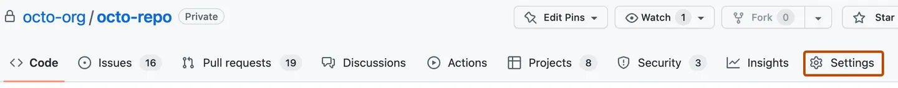

# RHOSO Day 2 Operations — Lab Automation

Ansible automation and lab exercises for the **Red Hat OpenStack Services on OpenShift (RHOSO)** Day 2 Operations workshop.

This repo automates the initial RHOSO deployment so students can focus on day-2 operational exercises without spending the full session on installation.

## Repositories

| Repository | Purpose | Action |
|---|---|---|
| `rh-osp-demo/showroom_osp-on-ocp-day2` | Lab content — kustomize overlays, ArgoCD manifests | **Fork** into your GitHub account |
| `gutseb/RHOSO-enablement` _(this repo)_ | Ansible automation that drives the lab | **Clone** directly |

## Lab Topics

| # | Topic | Playbook | Exercise |
|---|-------|----------|----------|
| 00 | Setup & Prerequisites | `playbooks/00-prerequisites.yml` | [lab-exercises/00-setup.md](lab-exercises/00-setup.md) |
| 01 | Install Operator Prerequisites (GitOps) | `playbooks/01-gitops-operators.yml` | [lab-exercises/01-prerequisites.md](lab-exercises/01-prerequisites.md) |
| 02 | Install RHOSO Operators (GitOps) | `playbooks/02-rhoso-operators.yml` | [lab-exercises/02-gitops-operators.md](lab-exercises/02-gitops-operators.md) |
| 03 | Configure Secure Access | `playbooks/03-secure-access.yml` | [lab-exercises/03-rhoso-operators.md](lab-exercises/03-rhoso-operators.md) |
| 04 | Install NFS Server | `playbooks/04-nfs-server.yml` | [lab-exercises/05-nfs-server.md](lab-exercises/05-nfs-server.md) |
| 05 | Deploy Control Plane (GitOps) | `playbooks/05-control-plane.yml` | [lab-exercises/06-control-plane.md](lab-exercises/06-control-plane.md) |
| 06 | **Networking Patch** _(if required)_ | `playbooks/06-networking-patch.yml` | [lab-exercises/07-networking-patch.md](lab-exercises/07-networking-patch.md) |
| 07 | Deploy Data Plane (GitOps) | `playbooks/07-data-plane.yml` | [lab-exercises/08-data-plane.md](lab-exercises/08-data-plane.md) |
| 08 | Access OpenStack | `playbooks/08-access-openstack.yml` | [lab-exercises/09-access-openstack.md](lab-exercises/09-access-openstack.md) |

## Quick Start

### 1. Fork the Showroom Repo

Fork `https://github.com/rh-osp-demo/showroom_osp-on-ocp-day2` into your GitHub account.
This is where your environment-specific manifests will be pushed.

[Set up your deploy keys](#deploy-keys)

### 2. Clone This Automation Repo on the Bastion

The playbooks run **on the bastion**. SSH in using the command from the lab
portal Overview tab, then clone directly (no fork needed):

```bash
# from the portal Overview tab, e.g.:
ssh lab-user@ssh.ocpv05.rhdp.net -p 30883

git clone https://github.com/gutseb/RHOSO-enablement.git
cd RHOSO-enablement
```

### 3. Set Your Lab Variables

Edit `inventory/group_vars/all/vars.yml`:

```yaml
lab_guid: "YOUR_GUID"                      # portal Overview tab (e.g. zf6s2)
github_id: "YOUR_GITHUB_ID"

# From the portal SSH command: ssh lab-user@<hostname> -p <port>
# Used to reach the internal lab hosts (nfsserver, compute01) from the bastion.
bastion_hostname: "ssh.ocpv05.rhdp.net"
bastion_port: "30883"
```

Add your key to ssh-agent also ensure your fork has this key with write permissions


```bash
eval "$(ssh-agent -s)"
ssh-add ~/.ssh/<GUID>key.pem      # e.g. ssh-add ~/.ssh/5mv5rkey.pem
# Identity added: /home/lab-user/.ssh/5mv5rkey.pem
```

### 4. Import the Lab Portal Details Variables

The portal **Details tab** provides an export block with your external IPs.
Import it (paste the block, then press `Ctrl+D`):

```bash
bash setup-lab-vars.sh
```

```bash
# example of the block you paste:
export EXTERNAL_IP_WORKER_1=192.168.19.192
export EXTERNAL_IP_WORKER_2=192.168.19.193
export EXTERNAL_IP_WORKER_3=192.168.19.194
export EXTERNAL_IP_BASTION=192.168.19.195
export PUBLIC_NET_START=192.168.19.196
export PUBLIC_NET_END=192.168.19.207
export CONVERSION_HOST_IP=192.168.19.202
```

These values feed the control-plane NNCP patches (05), the networking patch
(06), and the OpenStack access phase (08).

### 5. Set Up Your Vault (Secrets)

```bash
bash setup-vault.sh
```

Fill in your bastion password, OCP admin password, and Red Hat pull secret when prompted. The vault is encrypted and excluded from git.

### 6. Run All Phases

```bash
ansible-playbook playbooks/site.yml --ask-vault-pass
```

Or run a single phase:

```bash
ansible-playbook playbooks/05-control-plane.yml --ask-vault-pass
```

See [lab-exercises/00-setup.md](lab-exercises/00-setup.md) for the full
step-by-step setup, including GitHub deploy keys and SSH configuration.

## Troubleshooting

### `git push` to your fork fails (authentication)

The control-plane (05) and data-plane (07) phases push kustomize overlays to
**your fork** of the showroom repo. The bastion authenticates with the lab SSH
key pair — your fork must have the lab **public key** added as a **deploy key
with write access**, or the push fails with an authentication error.

- Public key on the bastion: `~/.ssh/<GUID>key.pub`
- Add it here: `https://github.com/<your_github_id>/showroom_osp-on-ocp-day2/settings/keys`
- GitHub reference: <https://docs.github.com/en/authentication/connecting-to-github-with-ssh/managing-deploy-keys>

Then load the lab **private key** into your ssh-agent on the bastion. The key
file is named after your lab GUID — for example, with GUID `5mv5r` the file is
`~/.ssh/5mv5rkey.pem`:

```bash
eval "$(ssh-agent -s)"
ssh-add ~/.ssh/<GUID>key.pem      # e.g. ssh-add ~/.ssh/5mv5rkey.pem
# Identity added: /home/lab-user/.ssh/5mv5rkey.pem
```

### Set up deploy keys (from the GitHub docs) {#deploy-keys}

1. Run the `ssh-keygen` procedure on your server, and remember where you save
   the generated public and private rsa key pair.
   _In this lab the key pair already exists on the bastion:
   `~/.ssh/<GUID>key.pem` / `~/.ssh/<GUID>key.pub` — skip this step._
2. On GitHub, navigate to the main page of the repository.
3. Under your repository name, click **Settings**. If you cannot see the
   "Settings" tab, select the dropdown menu, then click **Settings**.

   

4. In the sidebar, click **Deploy Keys**.
5. Click **Add deploy key**.
6. In the "Title" field, provide a title.
7. In the "Key" field, paste your public key.
8. Select **Allow write access** if you want this key to have write access to
   the repository. A deploy key with write access lets a deployment push to
   the repository. _Required for this lab._
9. Click **Add key**.

## Security Notes

- **`inventory/group_vars/all/vault.yml`** is in `.gitignore` — never committed
- `vault_template.yml` shows the required variable names without values — safe to commit
- SSH keys (`*.pem`, `*.key`) are excluded from git
- Use `ansible-vault edit inventory/group_vars/all/vault.yml` to update secrets

## Lab Infrastructure

Each student receives:
- **Lab UUID** — unique identifier for your environment (e.g. `zf6s2`)
- **Bastion host** — `lab-user@ssh.ocpv05.rhdp.net -p <PORT>`
- **OCP 4.16 cluster** — 3-node controller/worker
- **RHEL 9.4 compute** — virtualised data plane host
- **OCP Console** — `https://console-openshift-console.apps.cluster-<UUID>.dyn.redhatworkshops.io`

## Upstream References

- Lab content: https://github.com/rh-osp-demo/showroom_osp-on-ocp-day2

> The content in this repository is not officially supported by Red Hat. It is intended for exploratory and educational purposes.
